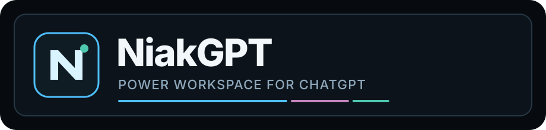

<div align="center">
  

  <p><strong>English</strong> · <a href="README.fr.md">Français</a></p>
  <p><strong>A local-first power workspace for ChatGPT.</strong></p>
  <p>Projects · long-thread performance · continuity · navigation · focused productivity</p>

  <p>
    
    
    
    
    
  </p>
</div>

---

# NiakGPT

NiakGPT is a browser extension that turns the ChatGPT web interface into a more capable **workspace for heavy, project-based use** without replacing ChatGPT itself.

It adds a native-first layer for Projects, navigation, long conversations, continuity, diagnostics and local productivity. Core features run locally in the browser: **no NiakGPT account, no NiakGPT analytics and no NiakGPT server are required**.

> **Current version: 0.9.82.** NiakGPT now mounts the Pins block directly once in the active ChatGPT sidebar instead of reparenting it across React shells, and the GitHub connection starter no longer sends a `chrome-extension://` URL to the web-auth API.

## Highlights

### Hydration-safe startup

NiakGPT JavaScript no longer runs at `document_start`: the bootstrap group now starts at `document_idle`, then waits for stable host node identities, a long DOM quiet window, two idle scheduler turns and animation frames before any NiakGPT mutation. A dedicated Chromium/Firefox/WebKit lab simulates late React work via `MessageChannel` and fails if NiakGPT activates during a false-calm window.

### Projects that behave like part of ChatGPT

- complete Project catalogue inside the verified native left sidebar;
- expandable Project rows with their conversations directly underneath;
- clicking a Project name opens/closes its drawer instead of unexpectedly navigating away;
- stable order, DOM identity, focus and scroll across cache refreshes, React remounts, SPA navigation and BFCache restores;
- direct-once Pins mounting: when ChatGPT replaces the sidebar, the old NiakGPT node is retired in place and a fresh block is mounted directly in the new active shell instead of moving a live node between React branches;
- current conversation, dates, counts and attention state kept visible;
- local search for large Projects;
- Project/chat action menus kept outside sidebar clipping and usable with mouse or keyboard;
- manual moves and continuity locks take priority over automatic classification.

NiakGPT deliberately separates responsibilities:

- `sidebar-projects-authority-v112.js` owns native Projects visibility;
- `sidebar-projects-v121.js` owns the NiakGPT catalogue and placement;
- `ux-v131.js` verifies the real sidebar and applies final UX/hit-testing guards.

This avoids multiple modules fighting over the same surface.

### Fast navigation

- **Alt+K** — Quick Open for Projects and conversations;
- canonical **Home → Project → conversation** breadcrumb;
- current-thread outline;
- compact local status;
- Project-aware navigation across ChatGPT route changes.

### Long-thread performance

NiakGPT reduces non-essential work when conversations become large:

- cold-history containment and incremental rendering helpers;
- reduced decoration during heavy activity;
- event-driven updates instead of permanent whole-document polling;
- Safe Mode to disable non-essential surfaces quickly;
- load guards that back off when native ChatGPT content is not ready.

NiakGPT does **not** globally replace `window.fetch`. The MAIN-world surface is intentionally limited to `page-bridge.js`.

### Continuity and long-running work

NiakGPT distinguishes three different cases instead of treating every continuation the same way:

1. **Parallel addition** — a message sent while work is already active can receive the compact `↳ Suite en parallèle` marker so it complements the current task.
2. **Long-run recovery** — after the bounded watchdog window (currently 6 min 30), NiakGPT may send a short `↻ Reprise NiakGPT` turn only when a real Send control is available and the composer is safe to use.
3. **Conversation-limit continuity** — when ChatGPT requires a new thread, NiakGPT can carry the continuity capsule into the new conversation and preserve the exact Project relationship when known.

User text always wins: modified drafts are never erased merely because they still contain a NiakGPT marker.

### Private Project Memory (optional)

NiakGPT 0.9.82 can attach a **user-selected private GitHub repository** to Project continuity from the Control Center, with a normal **Sign in with GitHub** flow and repository picker.

- connection is explicit and disabled by default;
- the GitHub App manifest starter opens in a normal extension tab and returns through the exact HTTPS `chromiumapp.org` callback; `launchWebAuthFlow` is used only with HTTP(S) GitHub URLs;
- the normal path is **Sign in with GitHub → GitHub permission screen → repository selection**; no PAT copy/paste is required;
- NiakGPT creates a private, per-browser-profile GitHub App through GitHub's manifest flow, with only **Contents: write** and **Metadata: read**;
- GitHub's own installation screen controls which repositories are accessible; the NiakGPT picker lists only authorized private, non-archived repositories;
- a newly created **zero-commit** private repository is initialized automatically on first connection;
- the selected repository is verified as **private before initialization and again before reads/writes**;
- first connection bootstraps every existing non-empty ChatGPT Project already indexed by NiakGPT;
- Project description/instructions, conversation history snapshots, task/decision/architecture signals and a compact `PROJECT_STATE.md` checkpoint are stored under a dedicated memory root;
- after bootstrap, only conversations whose update timestamp changed are reread;
- full history remains in GitHub and is **not** injected into every prompt;
- on a new Project thread, NiakGPT can prepend the bounded compact checkpoint once to the first user message;
- sync pauses while ChatGPT is generating, waiting, executing or showing a verification state, and an interrupted sync queue can resume later.

The public `niakw/NiakGPT` repository is never used as a user-memory destination and its GitHub Actions never receive the vault name or credentials. GitHub App credentials and refresh material stay in the local browser profile. A fine-grained PAT remains available only as an advanced fallback for environments where GitHub App installation is restricted.

### Quiet, native-first UI

The v131 UX layer removes the old “second application around ChatGPT” feeling:

- no permanent right-side layout reservation;
- right tools are a small reveal-on-demand dock;
- the full-width status bar is replaced by a passive capsule;
- the prompt coach is opt-in and compact;
- home/utility surfaces hide non-essential NiakGPT chrome;
- focus-visible and reduced-motion behavior are part of the contract.

### Local-first core, optional private sync

NiakGPT's core remains local-first. Version 0.9.81 declares:

```text
storage
scripting
identity
https://chatgpt.com/*
https://api.github.com/*
https://github.com/login/*
```

There is no NiakGPT telemetry, advertising SDK, analytics endpoint or NiakGPT cloud account. GitHub endpoints are used **only after an explicit Project Memory connection action**. The `identity` permission drives the interactive GitHub authorization window; `github.com/login/*` is limited to OAuth token exchange. Preferences, indexes, governance and recovery state remain local, while the optional memory repository is controlled by the user.

See [Privacy](PRIVACY.md) and [Security](SECURITY.md) for the exact data, token and network model.

## Installation

### Unpacked extension

1. Download or clone this repository.
2. Open `chrome://extensions` in Chrome, Brave or another compatible Chromium browser.
3. Enable **Developer mode**.
4. Choose **Load unpacked**.
5. Select the repository root containing `manifest.json`.
6. Reload any ChatGPT tabs that were already open.

### Release package

The packaging script builds a clean extension ZIP from the runtime declared by the manifest and background injector:

```bash
node tools/package-extension.mjs
```

Development labs, historical runtime and test artifacts are excluded from the installable ZIP.

## Keyboard shortcuts

| Action | Shortcut |
|---|---:|
| Quick Open | `Alt+K` |
| Local prompt optimizer | `Alt+P` |
| Control Center | `Alt+,` |

## Architecture

NiakGPT is a **Manifest V3** extension with a deliberately small privilege surface.

- **MAIN world:** `page-bridge.js` only.
- **Isolated world:** cache, metadata, governance, classification, sidebar, navigation, continuity, UI and diagnostics.
- **Hydration barrier:** all `document_start` pre-runtime modules wait for the host-hydrated signal before observers, timers or DOM mutation.
- **Boot barrier:** metadata sanitation completes before downstream cache consumers.
- **Projects:** one visibility authority, one catalogue/placement owner, one final UX guard.
- **Multi-tab:** WORKER/CLIENT coordination via local browser primitives.
- **Recovery:** bounded native recovery paths; no challenge bypass and no automatic page reload loop.
- **Project Memory:** optional post-core runtime; backend/content-script failures cannot block Projects, Pins or their action menus. Private-repository verification is mandatory and normal prompt flow uses only a compact checkpoint.

For the runtime order, ownership invariants and failure model, read [ARCHITECTURE.md](ARCHITECTURE.md).

## Testing

NiakGPT treats evidence levels explicitly:

1. static/runtime/package invariants;
2. deterministic browser fixtures in Chromium, Firefox and WebKit;
3. real MV3 extension loaded in browser processes against controlled ChatGPT-shaped fixtures;
4. authenticated live ChatGPT evidence only when a real authenticated session is actually used.

The CI matrix includes Linux, Windows and macOS coverage, Chromium/Firefox/WebKit experience gates, real MV3 Chromium runs, focused continuity/recovery tests and a macOS Brave stable gate.

A fixture passing does **not** override a contradictory real user screenshot. See [TESTING_TRUTH.md](TESTING_TRUTH.md) and the [Visual Lab](visual-lab/README.md).

## Repository maintenance

- installable packages are assembled from declared runtime files only;
- obsolete runtime is forbidden from leaking into release ZIPs;
- repository hygiene rejects generated junk and unreferenced top-level runtime files;
- historical regression labs are intentionally retained;
- GitHub Actions history is purged automatically once a week while keeping a short recent diagnostic window.

## Documentation

| Document | Purpose |
|---|---|
| [README.fr.md](README.fr.md) | French README |
| [ARCHITECTURE.md](ARCHITECTURE.md) | Runtime architecture and ownership invariants |
| [CHANGELOG.md](CHANGELOG.md) | Detailed release history |
| [RELEASE_NOTES_0.9.81.md](RELEASE_NOTES_0.9.81.md) | Current release summary |
| [TROUBLESHOOTING.md](TROUBLESHOOTING.md) | Diagnosis and recovery |
| [PRIVACY.md](PRIVACY.md) | Local data and network behavior |
| [SECURITY.md](SECURITY.md) | Security model and reporting |
| [CONTRIBUTING.md](CONTRIBUTING.md) | Contribution rules |
| [TESTING_TRUTH.md](TESTING_TRUTH.md) | What each test level actually proves |

## Project status

NiakGPT depends on the ChatGPT web UI and on a bounded set of internal web endpoints used by that UI. Those surfaces can change without notice. The project therefore favors **safe degradation, explicit ownership and reproducible regressions** over broad DOM interception.

NiakGPT is an independent community project and is not affiliated with or endorsed by OpenAI.

## License

NiakGPT is licensed under the **GNU General Public License v3.0 (GPL-3.0)**. See [LICENSE](LICENSE).
